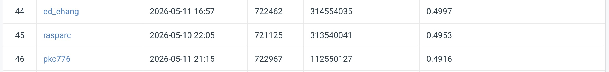

# NYCU Computer Vision with Deep learning Spring 2026 HW3
Student Id: 313540041
Name: Ruy Calderon

## Introduction
This repo contains the instance segmenter for the Spring 2026 "Special Topics in Computer Vision using Deep Learning" course.

The model was written in python using the pytorch computer vision module, along with the required dependencies.

The project is run in a virtual environment managed by the conda deployment, and is run on the mac osx operating system

This project uses the Mask-RCNN model with Resnet50 backbone for feature extraction

The designated training, validation, and testing datasets are provided as part of the homework assignment.

## Environment Setup
Describe how to create the environment and install dependencies.

```bash
# Create and activate environment
conda create -n myenv python=3.10
conda activate myenv

# Install dependencies
pip install -r requirements.txt
```

# Project Overview

The python file `entry.py` contains all the code required to train the classifier.

There are four possible command line arguments:

1. mode
2. data_path
3. validation_ratio
4. training_epochs
5. crop_size
6. checkpoint
7. output_path
8. score_threshold
9. mask_threshold

## Arguments

### mode
Select which mode you'd like to run in. There are two options:

1. `train` — Training  
2. `infer` — Inference  

### data_path
Specify the root directory for the image datapath.

### validation_ratio
Specify the proportion of the images you would like to use for the validation dataset.
The default is 0.2

### training_epochs
Select the desired number of training epochs. The default is 1

### crop_size
Select the desired crop size. The default is 512

### checkpoint
Select the path to the desired checkpoint you would like to load (optional.)

### output_path
Specify the output path of the json segmentation results for inference. The default value is:
"test_result.json"

### score_threshold
Set the minimum prediction threshold to keep. The default is 0.05

### mask_threshold
Set the threshold for converting soft masks to binary masks.

# Training

This is an example of how to train from scratch:

```bash
python ./entry.py --mode=train --data_path=../hw3-data-release --validation_ratio=0.2 --training_epochs=15 --crop_size=256
```

# Inference

This is an example of how run inference

```bash
-u ./entry.py \
  --mode=infer \
  --data_path=../hw3-data-release \
  --checkpoint=../checkpoints/e_14_ap50_0.73.pt \
  --crop_size=256 \
  --score_threshold=0.05 \
  --mask_threshold=0.5 \
  --output_path=test-results.json
```

# Performance Snapshot
[]